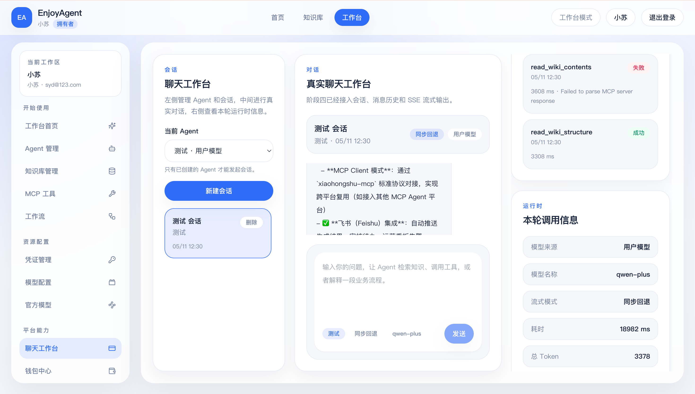
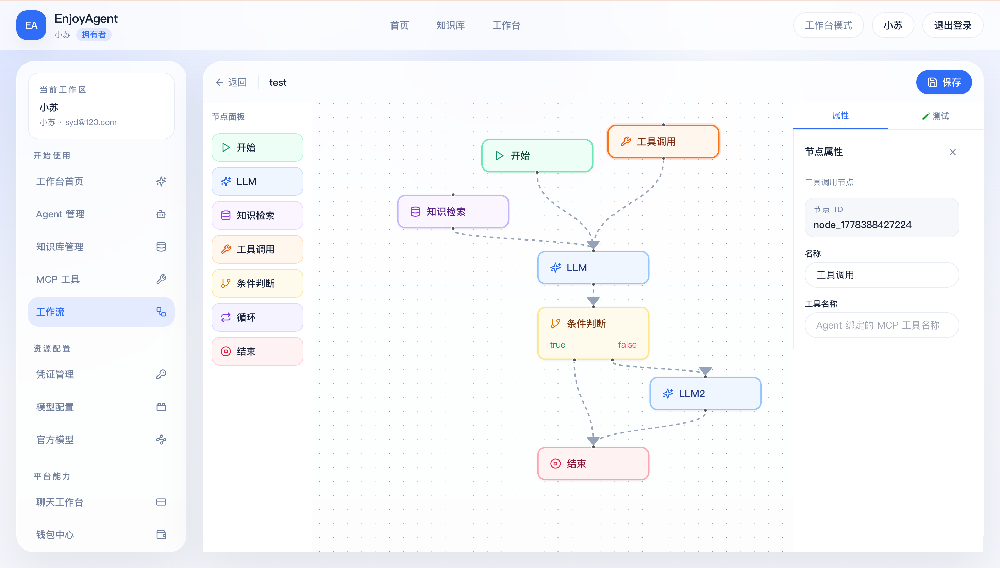
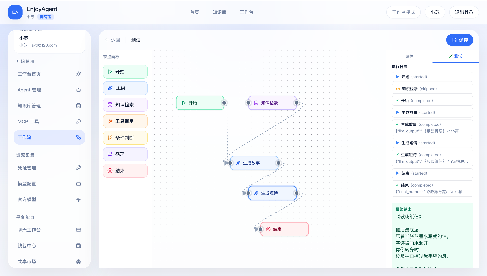
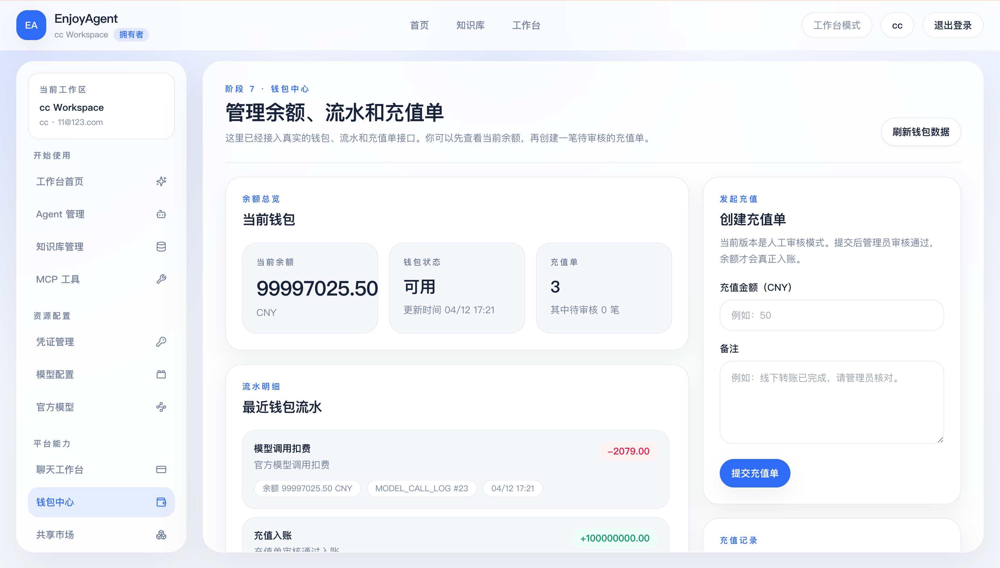

# EnjoyAgent Backend


EnjoyAgent 是一个面向真实业务场景设计的多租户 AI Agent 平台后端。它不只是一个模型 SDK Demo，而是把 Agent 平台里最关键的能力放在同一套可运行的 Spring Boot 工程里：认证、多租户、BYOK、官方模型、RAG、MCP、Workflow、钱包计费、共享市场和管理员审核。

如果你正在学习或准备搭建一个类似 Dify、Coze、扣子工作流、企业知识库问答或 Agent Marketplace 的系统，这个仓库可以作为一份比较完整的后端参考。

## 项目亮点

- **真实多租户平台骨架**：用户、租户、成员角色、系统管理员、JWT 鉴权和 `/api/admin/**` 权限边界已经串通。
- **BYOK + 平台官方模型双轨运行**：用户可以接自己的 OpenAI-compatible/百炼模型，平台也可以托管官方模型、价格和凭证。
- **完整 RAG 主链路**：文档上传、MinIO 存储、切片、embedding、pgvector、Query Rewrite、Rerank、Elasticsearch 混合检索和检索调试信息。
- **MCP 运行时接入**：支持 MCP Server 管理、工具同步、Agent 工具绑定、工具调用日志、OAuth Auth Code + PKCE、Client Credentials 和 token refresh。
- **可视化 Workflow 后端能力**：支持工作流、节点、连线持久化，测试运行和执行历史，为可拖拽 Agent Workflow 提供后端编排基础。
- **钱包与异步 token 计费**：官方模型调用会记录价格快照和 token 快照，通过 RabbitMQ 异步写入钱包流水。
- **共享市场不是弱引用**：Agent、知识库、MCP Server、Workflow 都可以提交市场，管理员审核后用户安装到自己的租户副本中。
- **工程化边界清晰**：Flyway 管迁移，应用服务承载业务编排，敏感凭证加密存储，日志和响应结构统一。

## 产品截图

这些截图来自 EnjoyAgent 前端，所有核心数据都由本后端 API 驱动。

### 聊天工作台



### 可视化工作流




### 钱包与充值审核



## 能力地图

```text
Auth / Tenant
  -> Credential
  -> Model Config / Official Model
  -> Agent
  -> Chat Runtime
  -> RAG
  -> MCP Tools
  -> Workflow
  -> Billing
  -> Marketplace
  -> Admin Review
```

## 技术栈

- Java 21
- Spring Boot 3.3
- Spring Security + JWT
- Spring Data JPA
- PostgreSQL + pgvector
- Redis
- RabbitMQ
- MinIO
- Elasticsearch
- Spring AI
- Flyway
- Swagger / OpenAPI

## 当前已实现

### 平台与权限

- 用户注册、登录、JWT 鉴权
- 多租户隔离
- 租户成员角色
- 系统管理员角色
- 管理端接口权限边界

### 模型与凭证

- 用户凭证管理
- AES 加密保存密钥
- 用户模型配置
- 官方模型配置
- 官方模型托管凭证
- 模型调用日志

### Agent 与聊天

- Agent CRUD
- 会话与消息持久化
- 普通聊天
- SSE 流式聊天
- RAG 上下文注入
- MCP 工具调用
- 用户模型与官方模型运行时分流

### 知识库与 RAG

- Knowledge Base / Document / Chunk
- MinIO 文件存储
- 文本抽取与切片
- Embedding 入库
- pgvector 向量检索
- Elasticsearch 混合检索
- Query Rewrite
- Rerank
- 检索调试信息

### MCP

- MCP Server 注册、编辑、启停
- Tool 目录同步
- Agent Tool 绑定
- MCP Tool 调用日志
- OAuth Auth Code + PKCE
- OAuth Client Credentials
- Access Token 刷新

### Workflow

- Workflow 列表、创建、更新、删除
- Canvas 节点和连线保存
- Start / LLM / Knowledge / Tool / Condition / Loop / End 节点模型
- 工作流测试运行
- 执行历史记录
- 工作流提交共享市场和安装复制

### Billing

- 用户钱包
- 充值单
- 管理员审核充值
- 人工调账
- 官方模型价格快照
- RabbitMQ 异步 token 计费
- 钱包流水

### Marketplace

- 提交 Agent / Knowledge Base / MCP Server / Workflow
- 管理员审核、驳回、下架
- 已上架资产列表
- 市场资产安装
- Agent 安装时复制知识库和 MCP 依赖
- Workflow 安装时复制节点、连线，并提示需要重绑定的租户级资源

## 快速启动

### 1. 启动基础设施

```bash
docker compose up -d
```

`compose.yml` 会启动：

```text
PostgreSQL      localhost:5432
Redis           localhost:6379
MinIO API       http://localhost:9000
MinIO Console   http://localhost:9001
RabbitMQ        localhost:5672
RabbitMQ UI     http://localhost:15672
Elasticsearch   http://localhost:9200
```

### 2. 准备环境变量

```bash
cp .env.example .env
```

默认配置已经适配本地 Docker 依赖。你可以按需修改模型网关、官方模型 key、MinIO、RabbitMQ、Elasticsearch 等配置。

### 3. 启动后端

```bash
mvn spring-boot:run
```

默认地址：

```text
API      http://localhost:8080
Swagger  http://localhost:8080/swagger-ui.html
```

## 推荐联调顺序

1. 注册用户并登录
2. 创建凭证
3. 创建聊天模型和 embedding 模型
4. 创建知识库并上传文档
5. 创建 Agent，绑定模型和知识库
6. 发起聊天，查看 RAG 命中与模型调用日志
7. 配置 MCP Server，同步工具并绑定 Agent
8. 创建工作流并测试运行
9. 提交资产到共享市场
10. 使用管理员审核市场资产和充值单

## 待开发路线图

- **集成测试固化**：把认证、RAG、MCP、Workflow、Billing、Marketplace 主链整理成可重复执行的 smoke tests。
- **市场版本系统**：支持资产版本、更新说明、安装升级和兼容性提示。
- **市场安装异步化**：知识库文档复制、索引重建、MCP 安装等长任务改为可追踪任务。
- **更细权限模型**：从 `USER / ADMIN` 演进到可配置 RBAC，例如审核员、运营、财务、只读管理员。
- **Workflow Runtime 增强**：节点级重试、运行日志可视化、失败恢复、变量面板、调试断点。
- **审计与观测**：补充管理员操作审计、模型调用统计、工具调用统计和计费事件追踪。
- **部署模板**：补 Docker app 服务、生产环境 profile、反向代理和对象存储配置说明。

## 文档

- [Agent.md](./Agent.md)：架构说明、核心设计取舍和协作原则
- [Plan.md](./Plan.md)：后续路线图和工程化优先级

## 适合谁看

- 想系统学习 Agent 平台后端设计的人
- 想把 RAG、MCP、Workflow、计费、市场放进一个真实项目里的人
- 想从 Demo 走向可运营 AI 平台的人

EnjoyAgent 的目标不是把每个功能都做成最复杂，而是把 AI Agent 平台最难串起来的主链路，尽量用清晰、可读、可运行的代码呈现出来。
